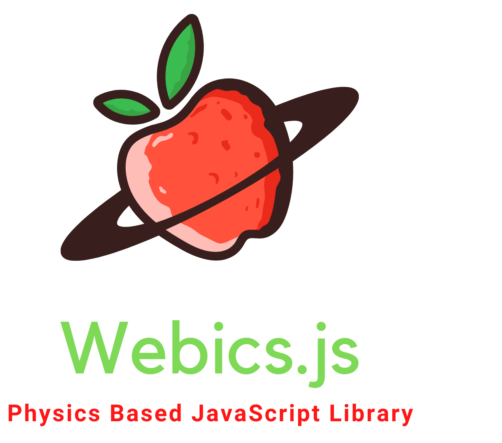

# Webics.js

Physics based Javascript library for physics enthusiasts who want verlet integration in there webpages

## Installation

Clone this repository and run the index.html file to view the demo system. This Project is currently under building phase and will expectedly be completed by December 2021.

## Current Features

The Library currently has features to replicate a ball and rod system in the influence of gravity, following Newton's Laws of Motion.

## Proposed Features

Currently, development is under process for the following modules-

- External forces, such as electrical forces
- Collision effect following Conservation of Momentum

And the following features will be implemented in future-

- Heat Zones that will effect a system's properties such as dimensions
- Fluid Dynamics for Liquid support
- Thermodynamics for Gaseous systems

## Contribution

Any Developer having love for physics is invited and welcome to contribute to the project.
